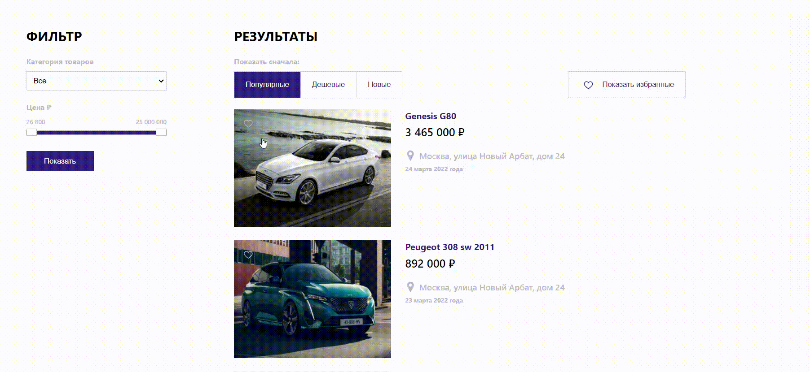

# Flea market
<div align="center">
  
</div>

### Stack
+ React
+ hooks
+ CSS modules
+ yandex map api
+ Mock data

### Installation
1) Open terminal
2) On command line, type in the following commands:
```console
$ cd client
```
3) Install packages:
```console
$ npm install
```
4) Start application (client):
```console
$ npm start
```
5) Open [http://localhost:3000](http://localhost:3000) to view it in the browser.